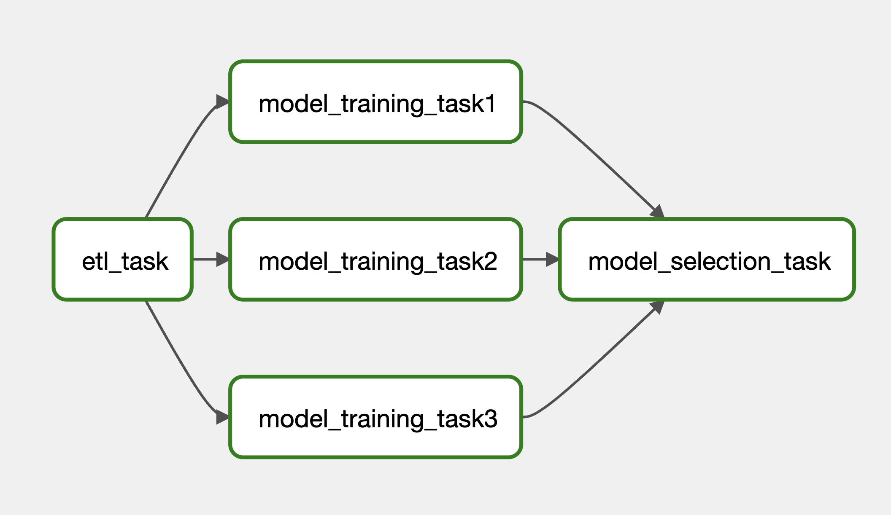
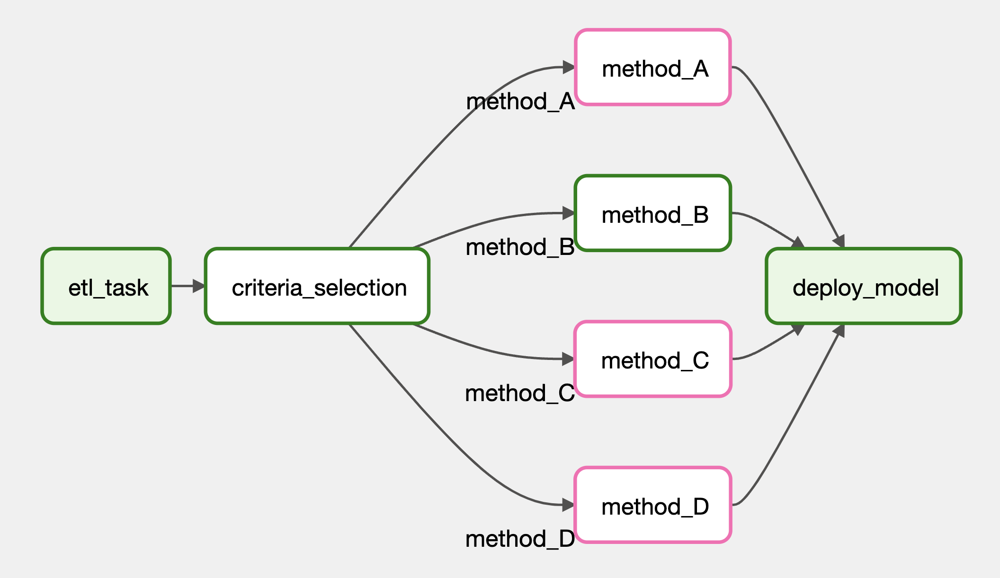

# Introduction

This article aims to introduce how to write an airflow DAG. We will go through the basic `BashOperator` and `PythonOperator`, using Airflow TaskFlow decorators, Airflow context, passing information between tasks using XComs, branching tasks based on conditions, and more. 

```{r, echo=F}
knitr::include_graphics("img/dag-list.png")
```

<!-- This article aims to introduce how to write an airflow dag with an example to build an ETL pipeline from YouTube Data API to a Postgres database. Please refer to the [previous article](../2023-08-05-introduction-to-docker-with-airflow-and-postgres-stack/) on how to host an Airflow and Postgres Docker container. It is good to have a controlled environment for these two applications in containers so that they will not have any dependency issues.  -->

<!-- As we will involve YouTueb Data API in the example, this article will first start with a brief introduction to YouTube Data API, then it will dive into how to write an Airflow DAG. Finally it will provide an ETL pipeline example to be run on Airflow.  -->

<!-- # YouTube Data API -->

<!-- To use [YouTube Data API](https://developers.google.com/youtube/v3), we need to have an API key or an authorised token. Please refer to the [previous article](../2023-07-29-rust-gapi-oauth2/) to obtain an authorised token. You can get an API key with similar method as shown in the article.  -->

<!-- After having either of the above, we can add the following headers when requesting the endpoints: -->

<!-- - For API key: `headers = {"x-goog-api-key": api_key}` -->
<!-- - For authorised token: `headers = {"Authorization": f"Bearer {access_token}"}` -->

<!-- ## Channels List Endpoint -->

<!-- The [`channels.list` method](https://developers.google.com/youtube/v3/docs/channels/list) allows us to fetch information about YouTube channels, including their number of subscribers and number of videos. It also offers a list of videos that have been uploaded by this channel. We can utilise this information for further analysis.  -->

<!-- Below shows a code snippet to fetch a channel information with this endpoint.  -->

<!-- ```{python, eval=F} -->
<!-- import os  -->
<!-- import requests  -->

<!-- API_KEY = os.getenv("GAPI_KEY") -->
<!-- url = "https://www.googleapis.com/youtube/v3/channels" -->

<!-- parts = [ -->
<!--     "brandingSettings", "contentDetails", "contentOwnerDetails", "id",  -->
<!--     "localizations", "snippet", "statistics", "status", "topicDetails" -->
<!-- ] -->
<!-- params = { -->
<!--     "id": "UCSXwxpWZQ7XZ1WL3wqevChA",    # comma separated channel id. Max 50 -->
<!--     "part": ",".join(parts) -->
<!-- } -->

<!-- headers = {"x-goog-api-key": API_KEY} -->

<!-- response = requests.get(url, params=params, headers=headers) -->
<!-- response.json() -->

<!-- # { -->
<!-- #     "kind": "youtube#channelListResponse", -->
<!-- #     "etag": "Tv4R37RghCrjIhGjwzOU4LMObXU", -->
<!-- #     "pageInfo": {...}, -->
<!-- #     "items": [ -->
<!-- #         { -->
<!-- #             "kind": "youtube#channel", -->
<!-- #             "etag": "uSDEMv9Bq-jmBQ944jhPmIThLG4", -->
<!-- #             "id": "UCSXwxpWZQ7XZ1WL3wqevChA", -->
<!-- #             "snippet": { -->
<!-- #                 "title": "Apache Airflow", -->
<!-- #                 "description": "...", -->
<!-- #                 "customUrl": "@apacheairflow", -->
<!-- #                 "publishedAt": "2019-06-27T10:06:48Z", -->
<!-- #                 "thumbnails": {...}, -->
<!-- #                 "localized": {...}, -->
<!-- #                 "country": "US" -->
<!-- #             }, -->
<!-- #             "contentDetails": { -->
<!-- #                 "relatedPlaylists": { -->
<!-- #                     "likes": "", -->
<!-- #                     "uploads": "UUSXwxpWZQ7XZ1WL3wqevChA" -->
<!-- #                 } -->
<!-- #             }, -->
<!-- #             "statistics": { -->
<!-- #                 "viewCount": "771386", -->
<!-- #                 "subscriberCount": "9490", -->
<!-- #                 "hiddenSubscriberCount": false, -->
<!-- #                 "videoCount": "176" -->
<!-- #             }, -->
<!-- #             "topicDetails": { -->
<!-- #                 "topicIds": [...], -->
<!-- #                 "topicCategories": [ -->
<!-- #                     "https://en.wikipedia.org/wiki/Lifestyle_(sociology)", -->
<!-- #                     "https://en.wikipedia.org/wiki/Technology", -->
<!-- #                     "https://en.wikipedia.org/wiki/Knowledge" -->
<!-- #                 ] -->
<!-- #             }, -->
<!-- #             "status": { -->
<!-- #                 "privacyStatus": "public", -->
<!-- #                 "isLinked": true, -->
<!-- #                 "longUploadsStatus": "longUploadsUnspecified" -->
<!-- #             }, -->
<!-- #             "brandingSettings": {...}, -->
<!-- #             "contentOwnerDetails": {} -->
<!-- #         } -->
<!-- #     ] -->
<!-- # } -->
<!-- ``` -->


<!-- ## Etag -->

<!-- An `etag` can be found from every response from the YouTube API. It is used to determine if a resource has changed (see more from [here](https://developers.google.com/youtube/v3/getting-started#etags)). As there is a quota limit on how many times we can call the API on each day, the `etag` can be used to check with the server if the requested resource has changed. If the resource has not changed, it will return http status `304` and we can reuse the same response from previous request. See the following example.  -->


<!-- ```{python, eval=F} -->
<!-- import os  -->
<!-- import requests  -->

<!-- API_KEY = os.getenv("GAPI_KEY") -->
<!-- url = "https://www.googleapis.com/youtube/v3/channels" -->

<!-- parts = [ -->
<!--     "brandingSettings", "contentDetails", "contentOwnerDetails", "id",  -->
<!--     "localizations", "snippet", "statistics", "status", "topicDetails" -->
<!-- ] -->
<!-- params = { -->
<!--     "id": "UCSXwxpWZQ7XZ1WL3wqevChA",    # comma separated channel id. Max 50 -->
<!--     "part": ",".join(parts) -->
<!-- } -->

<!-- headers = {"x-goog-api-key": API_KEY} -->

<!-- response = requests.get(url, params=params, headers=headers) -->
<!-- etag = response.json()["etag"] -->

<!-- # Another request -->
<!-- headers["if-none-match"] = etag     # Add previous etag to headers -->
<!-- response2 = requests.get(url, params=params, headers=headers) -->
<!-- response2 -->

<!-- # <Response [304]> -->
<!-- ``` -->

# DAG Location

This section will introduce how to write a  Directed Acyclic Graph (DAG) in Airflow. Within the Docker image's main folder, you should find a directory named `dags`. Create one if you do not. This directory should link to the containers as it is specified in the `docker-compose.yaml`. 

<div id="docker-compose">
```{yaml}
x-airflow-common:
  &airflow-common
  image: ${AIRFLOW_IMAGE_NAME:-apache/airflow:2.6.3}
  environment:
    ...
  volumes:
    - ${AIRFLOW_PROJ_DIR:-.}/dags:/opt/airflow/dags
    - ${AIRFLOW_PROJ_DIR:-.}/logs:/opt/airflow/logs
    - ${AIRFLOW_PROJ_DIR:-.}/config:/opt/airflow/config
    - ${AIRFLOW_PROJ_DIR:-.}/plugins:/opt/airflow/plugins
    - ${AIRFLOW_PROJ_DIR:-.}/dag-inputs:/opt/airflow/dag-inputs
    - ${AIRFLOW_PROJ_DIR:-.}/dag-outputs:/opt/airflow/dag-outputs
```
</div>

Inside the `dags` directory, create a file named `trial_dag.py` with the following content. It will create a DAG in Airflow and you can find it in the main page of Airflow (default: `localhost:8080`).

# Basic DAG File

Below shows an example of a DAG. 

```{python, eval=F}
from airflow import DAG
from datetime import datetime, timedelta
from airflow.operators.bash import BashOperator
from airflow.operators.python import PythonOperator

default_args = {
    "owner": "airflow",
    "retries": 5,
    "retry_delay": timedelta(minutes=2)
}

def _task2(w):
    print(w)

with DAG(
    dag_id="trial_dag",
    description="A trial dag",
    default_args=default_args,
    start_date=datetime(2023,8,1),
    # end_date=datetime(2024,7,31),
    schedule="@once"  # Use `schedule_interval` if using Airflow 2.3 or below
) as dag: 
    task1 = BashOperator(
        task_id="task1",
        bash_command=" echo 'hello'"
    )
    
    task2 = PythonOperator(
        task_id="task2",
        python_callable=_task2,
        op_kwargs={"w": "world"}
    )
    
    task1 >> task2  # The order of task being executed.
```

The snippet above shows a simple DAG definition file. It first imports the required modules from `airflow` and `datetime`. Then define the `default_args` for the dag (see more available key-value pairs [here](https://airflow.apache.org/docs/apache-airflow/1.10.8/tutorial.html#default-arguments)). 

There are multiple ways to initialise a dag. This time we used `with DAG() as dag:` with `dag_id`, `description`, `schedule`, etc. We will see some other methods to define a dag in later sections. 

A task in a dag is an operator object. There are two basic operators: `BashOperator` and `PythonOperator`. The `BashOperator` is used to execute bash command and the `PythonOperator` is used to execute Python functions. The name of the Python function is passed to the `python_callable` parameter and the arguments of the primitive function can be passed through the operator using the `op_kwargs` and `op_args` arguments. 

Finally we need to specify the order of the tasks by `task1 >> task2`. 

# Custom Operator

We can also create custom operators inside the `plugins` directory which is located at the main Docker image directory. Please make sure the directory is created and specified in [docker-compose.yaml](#docker-compose). Please also create an empty `__init__.py` in the `plugins` directory. Now, we can create a `.py` file inside the `plugins` directory to create operators like below.

```{python, eval=F}
# plugins/hello_operator.py

from airflow.models import BaseOperator

class HelloOperator(BaseOperator):
    def __init__(self, name, *args, **kwargs):
        super().__init__(*args, **kwargs)
        self.name = name

    def execute(self, context):
        self.log.info("Input `name`: {self.name}.") # Logging
        message = f"Hello {self.name}"
        print(message)
```

To use the custom operators, simply import the operators from a module as usual. 

```{python, eval=F}
from hello_operator import HelloOperator

with Dag() as dag:
    task1 = HelloOperator(task_id="task1", name="Bob")
    
    task1
```

# Airflow Context

Like Gibhub context (see [this article](../2023-08-03-github-actions-with-example/index.html#github-context)), Airflow also provide a way to access information about the running dag and task. As seen in the [custom operator](#custom-operator), the `execute` method in the operator class takes in a `context` argument. 

Below shows two examples on how to use these context information.

```{python, eval=F}
# plugins/hello_operator.py

from airflow.models import BaseOperator

class HelloOperator(BaseOperator):
    template_fields = ['name']
    
    def __init__(self, name, *args, **kwargs):
        super().__init__(*args, **kwargs)
        self.name = name

    def execute(self, context):   # context is a TypedDict. See below section
        message = f"The name of this DAG is {self.name}"
        print(message)
        
        ts = context["ts_nodash"] # context is a TypedDict. See below section
        print(f"This DAG started at {ts}")
```

The above snippet describe how to use the `context` variable inside a custom operator. One can also use `jinja` syntax to specify the information like below. Just remember to specify which argument will be using jinja syntax in the custom operator class (see above `template_fields = ['name']`).

```{python, eval=F}
# dags/hello_dag.py

from hello_operator import HelloOperator

with Dag() as dag:
    task1 = HelloOperator(task_id="task1", name="{{ dag.dag_id }}")
    
    task1
```

A detailed list of available values from context can be found in [appendix][#appendix].

# Taskflow

This section describe how to write a DAG with the TaskFlow API paradigm. The paradigm converts functions into Airflow DAGs or tasks with the `dag` and `task` decorators. Below shows a simple DAG written in this paradigm.

```{python, eval=F}
from airflow.decorators import task, dag
from airflow.operators.python import get_current_context
from datetime import datetime, timedelta

default_args = {
    "owner": "airflow",
    "retries": 0,
    "retry_delay": timedelta(minutes=2)
}

@dag(
    dag_id="trial_dag",
    schedule="@once",
    start_date=datetime(2023,8,1),
    default_args=default_args
)
def trial_dag():
    @task(task_id="task1")
    def task1():
        print("hello")
    
    @task(task_id="task2")
    def task2(name):
        context = get_current_context()    # Use context within TaskFlow API
        print(f"The name of the DAG is {name}")
        dag_loc = context["dag"].fileloc
        print(f"The location of the DAG is {dag_loc}")
    
    task1() >> task2("{{ dag.dag_id }}")   # Set the order of tasks

trial_dag()    # Initialise the DAG
```

# XComs

Often times, we would like to pass some information from the upstream task to the downstream task. In Airflow, we can achieve this via the XComs. Please note that XComs is not designed to transfer large data. If you are using MySQL as the Airflow database, you can only transfer information within 64kb. You can define your own XComs backend if needed. Yet, this is out of the scope of this article. 

There are two ways to send information in one task. 

1. Simply return the value (see `ModelTrainingOperator`)
2. Using `ti.xcom_push` (see `ETLOperator`)

The pushed values are stored in the Airflow context in the form of key-value pairs. That means, there is a specific key to each returned or pushed value. The key for the first method is always `return_value` but you can specify the key you want in the second method. 

As the pushed values are stored in the Airflow context, it can be accessed via the `context` argument (see `ModelSelectionOperator`) or via the jinja template (see `model_training_task1`). Yet, the values pulled from jinja template are always in text form. 

The script below mimics a ML model training pipeline, which utilises the XComs to transfer information between tasks. 

```{python, eval=F}
from airflow import DAG
from datetime import datetime, timedelta
from airflow.models import BaseOperator
from random import randint
import numpy as np

default_args = {
    "owner": "airflow",
    "retries": 0,
    "retry_delay": timedelta(minutes=2)
}

class ETLOperator(BaseOperator):
    template_fields = ['name']
    def __init__(self, name, *args, **kwargs):
        super().__init__(*args, **kwargs)
        self.name = name

    def execute(self, context):
        self.log.info(f"Input parameter: {self.name}")
        context["ti"].xcom_push(key="dag_id", value=self.name)

class ModelTrainingOperator(BaseOperator):
    template_fields = ['name']
    def __init__(self, name, *args, **kwargs):
        super().__init__(*args, **kwargs)
        self.name = name
    
    def execute(self, context):
        self.log.info(f"Previous output: {self.name}")
        task_id = context["ti"].task_id
        return {"task_id": task_id, "score": randint(1, 10)}

class ModelSelectionOperator(BaseOperator):
    def __init__(self, models, *args, **kwargs):
        super().__init__(*args, **kwargs)
        self.models = models
    
    def execute(self, context):
        models = self.models.split(",")
        result = []
        for model in models:
            result.append(context["ti"].xcom_pull(model))
        
        self.log.info(result)
        best_model = result[np.argmax([x["score"] for x in result])]
        self.log.info(f"Best model: {best_model}")

with DAG(
    dag_id="trial_dag",
    default_args=default_args,
    start_date=datetime(2023,8,1),
    schedule="@once",
    description="A trial dag"
) as dag: 
    etl_task = ETLOperator(
        task_id="etl_task",
        name="{{ dag.dag_id }}"
    )
    
    model_training_task1 = ModelTrainingOperator(
        task_id="model_training_task1",
        name="{{ ti.xcom_pull(task_ids=['etl_task'], key='dag_id') }}"
    )
    
    model_training_task2 = ModelTrainingOperator(
        task_id="model_training_task2",
        name="{{ ti.xcom_pull(task_ids=['etl_task'], key='dag_id') }}"
    )
    
    model_training_task3 = ModelTrainingOperator(
        task_id="model_training_task3",
        name="{{ ti.xcom_pull(task_ids=['etl_task'], key='dag_id') }}"
    )

    model_selection_task = ModelSelectionOperator(
        task_id="model_selection_task",
        models="model_training_task1,model_training_task2,model_training_task3"
    )
    
    etl_task >> \
    [model_training_task1, model_training_task2, model_training_task3] >> \
    model_selection_task
```

```{r, echo=F}

```

# Branching

The previous example will run all three `model_training` tasks after the `etl_task` has finished. This section shows how to do branching, which means to execute a particular task based on some conditions. 

```{python, eval=F}
from airflow import DAG
from datetime import datetime, timedelta
from airflow.models import BaseOperator
from airflow.utils.trigger_rule import TriggerRule
from airflow.operators.branch import BaseBranchOperator
from airflow.operators.empty import EmptyOperator
from airflow.utils.edgemodifier import Label
from random import randint, choice

default_args = {
    "owner": "airflow",
    "retries": 0,
    "retry_delay": timedelta(minutes=2)
}

class CriteriaBranchingOperator(BaseBranchOperator):
    def __init__(self, methods, *args, **kwargs):
        super().__init__(*args, **kwargs)
        self.methods = methods
    
    def choose_branch(self, context):
        return choice(self.methods)

class ModelTrainingOperator(BaseOperator):
    def execute(self, context):
        task_id = context["ti"].task_id
        return {"task_id": task_id, "score": randint(1, 10)}

with DAG(
    dag_id="trial_dag",
    default_args=default_args,
    start_date=datetime(2023,8,1),
    schedule="@once",
    description="A trial dag"
) as dag: 
    etl_task = EmptyOperator(
        task_id="etl_task"
    )

    methods = ["method_A", "method_B", "method_C", "method_D"]

    criteria_selection = CriteriaBranchingOperator(
        task_id="criteria_selection",
        methods=methods
    )

    etl_task >> criteria_selection

    deploy_model = EmptyOperator(
        task_id="deploy_model",
        trigger_rule=TriggerRule.NONE_FAILED_MIN_ONE_SUCCESS
    )

    for method in methods:
        method_task = ModelTrainingOperator(
            task_id=method
        )

        criteria_selection >> Label(method) >> method_task >> deploy_model
```

```{r "branching-dag", echo=F}

```

# Triggers

This section introduce triggers to start a DAG from another DAG. We will go through 2 different methods: 

1. Datasets
2. TriggerDAGRunOperator

## Datasets

To trigger a DAG using `Datasets`, the `Dataset` class must be imported first. Then define a dataset with an uri. In one of the task in the `trigger_dag`, set the `outlets` to a list of the defined dataset. Finally, in the `target_dag`, set the `schedule` to be a list of datasets that will trigger the DAG to run. See an example below.

```{python, eval=F}
from airflow import Dataset, DAG 
from airflow.models import BaseOperator
from datetime import datetime

dataset = Dataset("/opt/airflow/dag-outputs/test_data.json")

class TriggerOperator(BaseOperator):
    def execute(self, context):
        outlets = context["outlets"]
        ts = context["ts_nodash"]
        for outlet in outlets:
            with open(outlet.uri, "w") as f:
                f.write(ts)
        
        self.log.info(context["outlets"])
        # [2023-08-13, 21:34:06 UTC] {trial_dag.py:15} INFO - 
        #  [Dataset(uri='/opt/airflow/dag-outputs/test_data.json', extra=None)]

        self.log.info("Triggering Dataset")
        # [2023-08-13, 21:34:06 UTC] {trial_dag.py:16} INFO - Triggering Dataset

class ActionOperator(BaseOperator):
    def execute(self, context):
        self.log.info(context["dag"].schedule_interval)
        # [2023-08-13, 21:34:06 UTC] {trial_dag.py:20} INFO - Dataset
        
        self.log.info(context["dag"].dataset_triggers)
        # [2023-08-13, 21:34:06 UTC] {trial_dag.py:21} INFO - 
        #  [Dataset(uri='/opt/airflow/dag-outputs/test_data.json', extra=None)]

with DAG(
    dag_id="trigger_dag",
    schedule="@once",
    start_date=datetime(2023,8,1)
) as dag:
    trigger_task = TriggerOperator(
        task_id="trigger_task",
        outlets=[dataset]
    )

    trigger_task

with DAG(
    dag_id="target_dag",
    schedule=[dataset],
    start_date=datetime(2023,8,1)
) as dag:
    action_task = ActionOperator(
        task_id="action_task"
    )

    action_task
```

## TriggerDAGRunOperator

Another method to trigger a DAG to run is to use the `TriggerDAGRunOperator`. In the `trigger_dag`, create a task with `TriggerDAGRunOperator`, set the `trigger_dag_id` to the DAG you wish to trigger. You can also pass some information to the `target_dag` using the `conf` argument as shown below. 

In the `target_dag`, you can retrieve the `conf` by accessing `context["dag_run"].conf`. 

```{python, eval=F}
from airflow import DAG 
from airflow.models import BaseOperator
from airflow.operators.trigger_dagrun import TriggerDagRunOperator
from datetime import datetime

class ActionOperator(BaseOperator):
    def execute(self, context):
        # Retrieving conf from previous dag in TriggerDagRunOperator
        self.log.info(context["dag_run"].conf)
        # {"upstream_dag_id": "trigger_dag", "last_update": "..."}

with DAG(
    dag_id="trigger_dag",
    start_date=datetime(2023,8,1),
    schedule="@once"
) as dag:
    trigger_task = TriggerDagRunOperator(
        task_id="trigger_task",
        trigger_dag_id="target_dag",
        conf = {
            "upstream_dag_id": "{{ dag.dag_id }}",
            "last_update": "{{ ts_nodash }}"
        }
    )

    trigger_task

with DAG(
    dag_id="target_dag",
    start_date=datetime(2023,8,1),
    schedule="@once"
) as dag:
    action_task = ActionOperator(
        task_id="action_task"
    )

    action_task
```

# Variables

This section will cover how to define and use variables in Airflow context. 

## Set Up Variables

There are two ways to set up Airflow variables. 

1. On Airflow main page, go to *Admin --> Variables* and set up there. 
2. Set up environment variables with prefix `AIRFLOW_VAR_<NAME_OF_VAR>`.

## Calling Variables

```{python, eval=F}
from airflow import DAG 
from airflow.models import BaseOperator
from datetime import datetime
from airflow.models import Variable

class TrialOperator(BaseOperator):
    template_fields = ["json_var", "value_var"]
    def __init__(self, json_var, value_var, *args, **kwargs):
        super().__init__(*args, **kwargs)
        self.json_var = json_var
        self.value_var = value_var

    def execute(self, context):
        # Access from jinja template with type dict
        self.log.info(self.json_var)

        # Access from Variable with type dict
        self.log.info(Variable.get("my_var", deserialize_json=True))

        # Access from jinja template with type str
        self.log.info(self.value_var)

        # Access from Variable with type str
        self.log.info(Variable.get("my_var", deserialize_json=False))

        # The following will fail
        self.log.info(context["var"]["json"]["my_var"])

        # The following will fail
        self.log.info(context["var"]["value"]["my_var"])


with DAG(
    dag_id="trial_dag",
    start_date=datetime(2023,8,1),
    schedule="@once"
) as dag:
    task1 = TrialOperator(
        task_id="task1",
        json_var="{{  var.json.my_var  }}",
        value_var="{{  var.value.my_var  }}"
    )

    task1

# [2023-08-13, 18:12:03 UTC] {trial_dag.py:16} INFO - {'name': 'Bob', 'age': 21}
# [2023-08-13, 18:12:03 UTC] {trial_dag.py:19} INFO - {'name': 'Bob', 'age': 21}
# [2023-08-13, 18:12:03 UTC] {trial_dag.py:22} INFO - {"name": "Bob", "age": 21}
# [2023-08-13, 18:12:03 UTC] {trial_dag.py:25} INFO - {"name": "Bob", "age": 21}
```

## Encrypt Values

To encrypt the value of variables, first generate a `fernet_key` from the following.

```{python, eval=F}
from cryptography.fernet import Fernet
Fernet.generate_key().decode()

# 'bbg62_v203tply8_kXf8rD4WJ93IDYw6EVdQ7u2G-Bk='
```

Then change the following line in `airflow.cfg` under `[core]` section.

```{zsh, eval=F}
[core]
...
fernet_key = bbg62_v203tply8_kXf8rD4WJ93IDYw6EVdQ7u2G-Bk=
```

Finally rebuild the Docker containers. Now all the variables created in *Admin --> Variables* are encrypted. One can check the `variable` table from the Postgres container.

```{sql, eval=F}
SELECT * FROM variable;

--  id |   key    |          val          | description | is_encrypted 
-- ----+----------+-----------------------+-------------+--------------
--   1 | my_var   | gAAAAABk2...wiuSFTRw= |             | t
--   2 | my_token | gAAAAABk2...goZh6tg== |             | t
```

## Masking Values

By default, Airflow will hide the variable value if its key contains `access_token`, `api_key`, `apikey`,`authorization`, `passphrase`, `passwd`, `password`, `private_key`, `secret` or `token`. To extend the list, you can specify them in the `airflow.cfg`.

```{yml}
[core]
sensitive_var_conn_names = comma,separated,sensitive,names
```

```{python, eval=F}
from airflow import DAG 
from airflow.models import BaseOperator
from datetime import datetime
from airflow.models import Variable

class TrialOperator(BaseOperator):
    def execute(self, context):
        my_token = Variable.get("my_token", deserialize_json=False)
        self.log.info(my_token)
        self.log.info(my_token == "123456")

with DAG(
    dag_id="trial_dag",
    start_date=datetime(2023,8,1),
    schedule="@once"
) as dag:
    task1 = TrialOperator(
        task_id="task1"
    )

    task1

# [2023-08-13, 18:16:04 UTC] {trial_dag.py:9} INFO - ***
# [2023-08-13, 18:16:04 UTC] {trial_dag.py:10} INFO - True
```

# Appendix

```{python, eval=F}
# Context dictionary
{
    'conf': <***.configuration.AirflowConfigParser object at 0xffff82ce0c10>, # Not useful
    'dag': <DAG: trial_dag>, 
    'dag_run': <DagRun trial_dag @ 2023-08-11 11:51:11.303634+00:00: manual__2023-08-11T11:51:11.303634+00:00, state:running, queued_at: 2023-08-11 11:51:11.312548+00:00. externally triggered: True>, 
    'data_interval_end': DateTime(2023, 8, 11, 11, 51, 11, 303634, tzinfo=Timezone('UTC')), 
    'data_interval_start': DateTime(2023, 8, 11, 11, 51, 11, 303634, tzinfo=Timezone('UTC')), 
    'ds': '2023-08-11', 
    'ds_nodash': '20230811', 
    'execution_date': DateTime(2023, 8, 11, 11, 51, 11, 303634, tzinfo=Timezone('UTC')), 
    'expanded_ti_count': None, 
    'inlets': [], 
    'logical_date': DateTime(2023, 8, 11, 11, 51, 11, 303634, tzinfo=Timezone('UTC')), 
    'macros': <module '***.macros' from '/home/***/.local/lib/python3.7/site-packages/***/macros/__init__.py'>, 
    'next_ds': '2023-08-11', 
    'next_ds_nodash': '20230811', 
    'next_execution_date': DateTime(2023, 8, 11, 11, 51, 11, 303634, tzinfo=Timezone('UTC')), 
    'outlets': [], 
    'params': {}, 
    'prev_data_interval_start_success': DateTime(2023, 8, 11, 11, 44, 10, 670770, tzinfo=Timezone('UTC')), 
    'prev_data_interval_end_success': DateTime(2023, 8, 11, 11, 44, 10, 670770, tzinfo=Timezone('UTC')), 
    'prev_ds': '2023-08-11', 
    'prev_ds_nodash': '20230811', 
    'prev_execution_date': DateTime(2023, 8, 11, 11, 51, 11, 303634, tzinfo=Timezone('UTC')), 
    'prev_execution_date_success': DateTime(2023, 8, 11, 11, 44, 10, 670770, tzinfo=Timezone('UTC')), 
    'prev_start_date_success': DateTime(2023, 8, 11, 11, 44, 11, 512290, tzinfo=Timezone('UTC')), 
    'run_id': 'manual__2023-08-11T11:51:11.303634+00:00', 
    'task': <Task(HelloOperator): task2>, 
    'task_instance': <TaskInstance: trial_dag.task2 manual__2023-08-11T11:51:11.303634+00:00 [running]>, 
    'task_instance_key_str': 'trial_dag__task2__20230811', 
    'test_mode': False, 
    'ti': <TaskInstance: trial_dag.task2 manual__2023-08-11T11:51:11.303634+00:00 [running]>, 
    'tomorrow_ds': '2023-08-12', 
    'tomorrow_ds_nodash': '20230812', 
    'triggering_dataset_events': <Proxy at 0xffff7ac07230 with factory <function TaskInstance.get_template_context.<locals>.get_triggering_events at 0xffff7abe78c0>>, 
    'ts': '2023-08-11T11:51:11.303634+00:00', 
    'ts_nodash': '20230811T115111', 
    'ts_nodash_with_tz': '20230811T115111.303634+0000', 
    'var': {'json': None, 'value': None}, 
    'conn': None, 
    'yesterday_ds': '2023-08-10', 
    'yesterday_ds_nodash': '20230810'
}
```

```{python, eval=F}
# context["dag"]
{
    'access_control': None, 
    'add_task': <bound method DAG.add_task of <DAG: trial_dag>>, 
    'add_tasks': <bound method DAG.add_tasks of <DAG: trial_dag>>, 
    'allow_future_exec_dates': False, 
    'auto_register': True, 
    'bulk_sync_to_db': <bound method DAG.bulk_sync_to_db of <class '***.models.dag.DAG'>>, 
    'bulk_write_to_db': <bound method DAG.bulk_write_to_db of <class '***.models.dag.DAG'>>, 
    'catchup': True, 
    'clear': <bound method DAG.clear of <DAG: trial_dag>>, 
    'clear_dags': <bound method DAG.clear_dags of <class '***.models.dag.DAG'>>, 
    'cli': <bound method DAG.cli of <DAG: trial_dag>>, 
    'concurrency': 16, 
    'concurrency_reached': False, 
    'create_dagrun': <bound method DAG.create_dagrun of <DAG: trial_dag>>, 
    'dag_id': 'trial_dag', 
    'dagrun_timeout': None, 
    'dataset_triggers': [], 
    'date_range': <bound method DAG.date_range of <DAG: trial_dag>>, 
    'deactivate_stale_dags': <function DAG.deactivate_stale_dags at 0xffff7ed833b0>, 
    'deactivate_unknown_dags': <function DAG.deactivate_unknown_dags at 0xffff7ed83290>, 
    'default_args': {'owner': '***', 'retries': 0, 'retry_delay': datetime.timedelta(seconds=120)}, 
    'default_view': 'grid', 
    'description': 'A trial dag', 
    'doc_md': None, 
    'edge_info': {}, 
    'end_date': None, 
    'fileloc': '/opt/***/dags/trial_dag.py', 
    'filepath': 'trial_dag.py', 
    'folder': '/opt/***/dags', 
    'following_schedule': <bound method DAG.following_schedule of <DAG: trial_dag>>, 
    'full_filepath': '/opt/***/dags/trial_dag.py', 
    'get_active_runs': <bound method DAG.get_active_runs of <DAG: trial_dag>>, 
    'get_concurrency_reached': <bound method DAG.get_concurrency_reached of <DAG: trial_dag>>, 
    'get_dagrun': <bound method DAG.get_dagrun of <DAG: trial_dag>>, 
    'get_dagruns_between': <bound method DAG.get_dagruns_between of <DAG: trial_dag>>, 
    'get_default_view': <bound method DAG.get_default_view of <DAG: trial_dag>>, 
    'get_doc_md': <bound method DAG.get_doc_md of <DAG: trial_dag>>, 
    'get_edge_info': <bound method DAG.get_edge_info of <DAG: trial_dag>>, 
    'get_is_active': <bound method DAG.get_is_active of <DAG: trial_dag>>, 
    'get_is_paused': <bound method DAG.get_is_paused of <DAG: trial_dag>>, 
    'get_last_dagrun': <bound method DAG.get_last_dagrun of <DAG: trial_dag>>, 
    'get_latest_execution_date': <bound method DAG.get_latest_execution_date of <DAG: trial_dag>>, 
    'get_next_data_interval': <bound method DAG.get_next_data_interval of <DAG: trial_dag>>, 
    'get_num_active_runs': <bound method DAG.get_num_active_runs of <DAG: trial_dag>>, 
    'get_num_task_instances': <function DAG.get_num_task_instances at 0xffff7ed834d0>, 
    'get_run_data_interval': <bound method DAG.get_run_data_interval of <DAG: trial_dag>>, 
    'get_run_dates': <bound method DAG.get_run_dates of <DAG: trial_dag>>, 
    'get_serialized_fields': <bound method DAG.get_serialized_fields of <class '***.models.dag.DAG'>>, 
    'get_task': <bound method DAG.get_task of <DAG: trial_dag>>, 
    'get_task_instances': <bound method DAG.get_task_instances of <DAG: trial_dag>>, 
    'get_task_instances_before': <bound method DAG.get_task_instances_before of <DAG: trial_dag>>, 
    'get_template_env': <bound method DAG.get_template_env of <DAG: trial_dag>>, 
    'handle_callback': <bound method DAG.handle_callback of <DAG: trial_dag>>, 
    'has_dag_runs': <bound method DAG.has_dag_runs of <DAG: trial_dag>>, 
    'has_on_failure_callback': False, 
    'has_on_success_callback': False, 
    'has_task': <bound method DAG.has_task of <DAG: trial_dag>>, 
    'has_task_group': <bound method DAG.has_task_group of <DAG: trial_dag>>, 
    'infer_automated_data_interval': <bound method DAG.infer_automated_data_interval of <DAG: trial_dag>>, 
    'is_fixed_time_schedule': <bound method DAG.is_fixed_time_schedule of <DAG: trial_dag>>, 
    'is_paused': False, 
    'is_paused_upon_creation': None, 
    'is_subdag': False, 
    'iter_dagrun_infos_between': <bound method DAG.iter_dagrun_infos_between of <DAG: trial_dag>>, 
    'iter_invalid_owner_links': <bound method DAG.iter_invalid_owner_links of <DAG: trial_dag>>, 
    'jinja_environment_kwargs': None, 
    'last_loaded': datetime.datetime(2023, 8, 11, 12, 7, 12, 429629, tzinfo=Timezone('UTC')), 
    'latest_execution_date': datetime.datetime(2023, 8, 11, 12, 7, 10, 904583, tzinfo=Timezone('UTC')), 
    'leaves': [<Task(HelloOperator): task2>], 
    'log': <Logger ***.models.dag.DAG (INFO)>, 
    'logger': <bound method LoggingMixin.logger of <class '***.models.dag.DAG'>>, 
    'max_active_runs': 16, 
    'max_active_tasks': 16, 
    'next_dagrun_after_date': <bound method DAG.next_dagrun_after_date of <DAG: trial_dag>>, 
    'next_dagrun_info': <bound method DAG.next_dagrun_info of <DAG: trial_dag>>, 
    'normalize_schedule': <bound method DAG.normalize_schedule of <DAG: trial_dag>>, 
    'normalized_schedule_interval': None, 
    'on_failure_callback': None, 
    'on_success_callback': None, 
    'orientation': 'LR', 
    'owner': '***', 
    'owner_links': {}, 
    'param': <bound method DAG.param of <DAG: trial_dag>>, 
    'params': {}, 
    'parent_dag': None, 
    'partial': False, 
    'partial_subset': <bound method DAG.partial_subset of <DAG: trial_dag>>, 
    'pickle': <bound method DAG.pickle of <DAG: trial_dag>>, 
    'pickle_id': None, 
    'pickle_info': <bound method DAG.pickle_info of <DAG: trial_dag>>, 
    'previous_schedule': <bound method DAG.previous_schedule of <DAG: trial_dag>>, 
    'relative_fileloc': PosixPath('trial_dag.py'), 
    'render_template_as_native_obj': False, 
    'resolve_template_files': <bound method DAG.resolve_template_files of <DAG: trial_dag>>, 
    'roots': [<Task(BashOperator): task1>], 
    'run': <bound method DAG.run of <DAG: trial_dag>>, 
    'safe_dag_id': 'trial_dag', 
    'schedule_interval': '@once', 
    'set_dag_runs_state': <bound method DAG.set_dag_runs_state of <DAG: trial_dag>>, 
    'set_dependency': <bound method DAG.set_dependency of <DAG: trial_dag>>,
    'set_edge_info': <bound method DAG.set_edge_info of <DAG: trial_dag>>, 
    'set_task_instance_state': <bound method DAG.set_task_instance_state of <DAG: trial_dag>>, 
    'sla_miss_callback': None, 
    'start_date': DateTime(2023, 8, 1, 0, 0, 0, tzinfo=Timezone('UTC')), 
    'sub_dag': <bound method DAG.sub_dag of <DAG: trial_dag>>, 
    'subdags': [], 
    'sync_to_db': <bound method DAG.sync_to_db of <DAG: trial_dag>>, 
    'tags': [], 'task': functools.partial(<***.decorators.TaskDecoratorCollection object at 0xffff7aafde10>, dag=<DAG: trial_dag>), 
    'task_count': 2, 
    'task_dict': {'task1': <Task(BashOperator): task1>, 'task2': <Task(HelloOperator): task2>}, 
    'task_group': <***.utils.task_group.TaskGroup object at 0xffff7be957d0>, 
    'task_group_dict': {}, 
    'task_ids': ['task1', 'task2'], 
    'tasks': [<Task(BashOperator): task1>, <Task(HelloOperator): task2>], 
    'template_searchpath': None, 
    'template_undefined': <class 'jinja2.runtime.StrictUndefined'>, 
    'test': <bound method DAG.test of <DAG: trial_dag>>, 
    'timetable': <***.timetables.simple.OnceTimetable object at 0xffff7bed0410>, 
    'timezone': Timezone('UTC'), 
    'topological_sort': <bound method DAG.topological_sort of <DAG: trial_dag>>, 
    'tree_view': <bound method DAG.tree_view of <DAG: trial_dag>>, 
    'user_defined_filters': None, 
    'user_defined_macros': None, 
    'validate': <bound method DAG.validate of <DAG: trial_dag>>, 
    'validate_schedule_and_params': <bound method DAG.validate_schedule_and_params of <DAG: trial_dag>>
}
```

```{python, eval=F}
# context["ti"]
{
    'are_dependencies_met': <bound method TaskInstance.are_dependencies_met of <TaskInstance: trial_dag.task2 manual__2023-08-11T12:45:13.996317+00:00 [running]>>, 
    'are_dependents_done': <bound method TaskInstance.are_dependents_done of <TaskInstance: trial_dag.task2 manual__2023-08-11T12:45:13.996317+00:00 [running]>>, 
    'check_and_change_state_before_execution': <bound method TaskInstance.check_and_change_state_before_execution of <TaskInstance: trial_dag.task2 manual__2023-08-11T12:45:13.996317+00:00 [running]>>, 
    'clear_db_references': <bound method TaskInstance.clear_db_references of <TaskInstance: trial_dag.task2 manual__2023-08-11T12:45:13.996317+00:00 [running]>>, 
    'clear_next_method_args': <bound method TaskInstance.clear_next_method_args of <TaskInstance: trial_dag.task2 manual__2023-08-11T12:45:13.996317+00:00 [running]>>, 
    'clear_xcom_data': <bound method TaskInstance.clear_xcom_data of <TaskInstance: trial_dag.task2 manual__2023-08-11T12:45:13.996317+00:00 [running]>>, 
    'command_as_list': <bound method TaskInstance.command_as_list of <TaskInstance: trial_dag.task2 manual__2023-08-11T12:45:13.996317+00:00 [running]>>, 
    'current_state': <bound method TaskInstance.current_state of <TaskInstance: trial_dag.task2 manual__2023-08-11T12:45:13.996317+00:00 [running]>>, 
    'dag_id': 'trial_dag', 
    'dag_run': <DagRun trial_dag @ 2023-08-11 12:45:13.996317+00:00: manual__2023-08-11T12:45:13.996317+00:00, state:running, queued_at: 2023-08-11 12:45:14.009070+00:00. externally triggered: True>, 
    'dry_run': <bound method TaskInstance.dry_run of <TaskInstance: trial_dag.task2 manual__2023-08-11T12:45:13.996317+00:00 [running]>>, 
    'duration': None, 
    'email_alert': <bound method TaskInstance.email_alert of <TaskInstance: trial_dag.task2 manual__2023-08-11T12:45:13.996317+00:00 [running]>>, 
    'end_date': None, 
    'error': <bound method TaskInstance.error of <TaskInstance: trial_dag.task2 manual__2023-08-11T12:45:13.996317+00:00 [running]>>, 
    'execution_date': datetime.datetime(2023, 8, 11, 12, 45, 13, 996317, tzinfo=Timezone('UTC')), 
    'executor_config': {}, 
    'external_executor_id': None, 
    'filter_for_tis': <function TaskInstance.filter_for_tis at 0xffff7ed49050>, 
    'generate_command': <function TaskInstance.generate_command at 0xffff7ed3f200>, 
    'get_dagrun': <bound method TaskInstance.get_dagrun of <TaskInstance: trial_dag.task2 manual__2023-08-11T12:45:13.996317+00:00 [running]>>, 
    'get_email_subject_content': <bound method TaskInstance.get_email_subject_content of <TaskInstance: trial_dag.task2 manual__2023-08-11T12:45:13.996317+00:00 [running]>>, 
    'get_failed_dep_statuses': <bound method TaskInstance.get_failed_dep_statuses of <TaskInstance: trial_dag.task2 manual__2023-08-11T12:45:13.996317+00:00 [running]>>, 
    'get_num_running_task_instances': <bound method TaskInstance.get_num_running_task_instances of <TaskInstance: trial_dag.task2 manual__2023-08-11T12:45:13.996317+00:00 [running]>>, 
    'get_previous_dagrun': <bound method TaskInstance.get_previous_dagrun of <TaskInstance: trial_dag.task2 manual__2023-08-11T12:45:13.996317+00:00 [running]>>, 
    'get_previous_execution_date': <bound method TaskInstance.get_previous_execution_date of <TaskInstance: trial_dag.task2 manual__2023-08-11T12:45:13.996317+00:00 [running]>>, 
    'get_previous_start_date': <bound method TaskInstance.get_previous_start_date of <TaskInstance: trial_dag.task2 manual__2023-08-11T12:45:13.996317+00:00 [running]>>, 
    'get_previous_ti': <bound method TaskInstance.get_previous_ti of <TaskInstance: trial_dag.task2 manual__2023-08-11T12:45:13.996317+00:00 [running]>>, 
    'get_relevant_upstream_map_indexes': <bound method TaskInstance.get_relevant_upstream_map_indexes of <TaskInstance: trial_dag.task2 manual__2023-08-11T12:45:13.996317+00:00 [running]>>, 
    'get_rendered_k8s_spec': <bound method TaskInstance.get_rendered_k8s_spec of <TaskInstance: trial_dag.task2 manual__2023-08-11T12:45:13.996317+00:00 [running]>>, 
    'get_rendered_template_fields': <bound method TaskInstance.get_rendered_template_fields of <TaskInstance: trial_dag.task2 manual__2023-08-11T12:45:13.996317+00:00 [running]>>, 
    'get_template_context': <bound method TaskInstance.get_template_context of <TaskInstance: trial_dag.task2 manual__2023-08-11T12:45:13.996317+00:00 [running]>>, 
    'get_truncated_error_traceback': <function TaskInstance.get_truncated_error_traceback at 0xffff7ed46320>, 
    'handle_failure': <bound method TaskInstance.handle_failure of <TaskInstance: trial_dag.task2 manual__2023-08-11T12:45:13.996317+00:00 [running]>>, 
    'hostname': '7a02942b92a8', 
    'init_on_load': <bound method TaskInstance.init_on_load of <TaskInstance: trial_dag.task2 manual__2023-08-11T12:45:13.996317+00:00 [running]>>, 
    'init_run_context': <bound method TaskInstance.init_run_context of <TaskInstance: trial_dag.task2 manual__2023-08-11T12:45:13.996317+00:00 [running]>>, 
    'insert_mapping': <function TaskInstance.insert_mapping at 0xffff7ed37dd0>, 
    'is_eligible_to_retry': <bound method TaskInstance.is_eligible_to_retry of <TaskInstance: trial_dag.task2 manual__2023-08-11T12:45:13.996317+00:00 [running]>>, 
    'is_premature': False, 
    'is_trigger_log_context': False, 
    'job_id': '86', 
    'key': TaskInstanceKey(dag_id='trial_dag', task_id='task2', run_id='manual__2023-08-11T12:45:13.996317+00:00', try_number=1, map_index=-1), 
    'log': <Logger ***.task (INFO)>, 
    'log_url': 'http://localhost:8080/log?execution_date=2023-08-11T12%3A45%3A13.996317%2B00%3A00&task_id=task2&dag_id=trial_dag&map_index=-1', 
    'logger': <bound method LoggingMixin.logger of <class '***.models.taskinstance.TaskInstance'>>, 
    'map_index': -1, 
    'mark_success_url': 'http://localhost:8080/confirm?task_id=task2&dag_id=trial_dag&dag_run_id=manual__2023-08-11T12%3A45%3A13.996317%2B00%3A00&upstream=false&downstream=false&state=success', 
    'max_tries': 0, 
    'metadata': MetaData(), 
    'next_kwargs': None, 
    'next_method': None, 
    'next_retry_datetime': <bound method TaskInstance.next_retry_datetime of <TaskInstance: trial_dag.task2 manual__2023-08-11T12:45:13.996317+00:00 [running]>>, 
    'next_try_number': 2, 
    'operator': 'HelloOperator', 
    'overwrite_params_with_dag_run_conf': <bound method TaskInstance.overwrite_params_with_dag_run_conf of <TaskInstance: trial_dag.task2 manual__2023-08-11T12:45:13.996317+00:00 [running]>>, 
    'pid': 10659, 
    'pool': 'default_pool', 
    'pool_slots': 1, 
    'prev_attempted_tries': 1, 
    'previous_start_date_success': DateTime(2023, 8, 11, 12, 37, 0, 737891, tzinfo=Timezone('UTC')), 
    'previous_ti': None, 
    'previous_ti_success': <TaskInstance: trial_dag.task2 manual__2023-08-11T12:36:58.934316+00:00 [success]>, 
    'priority_weight': 1, 
    'queue': 'default', 
    'queued_by_job_id': 8, 
    'queued_dttm': datetime.datetime(2023, 8, 11, 12, 45, 15, 464793, tzinfo=Timezone('UTC')), 
    'raw': True, 
    'ready_for_retry': <bound method TaskInstance.ready_for_retry of <TaskInstance: trial_dag.task2 manual__2023-08-11T12:45:13.996317+00:00 [running]>>, 
    'refresh_from_db': <bound method TaskInstance.refresh_from_db of <TaskInstance: trial_dag.task2 manual__2023-08-11T12:45:13.996317+00:00 [running]>>, 
    'refresh_from_task': <bound method TaskInstance.refresh_from_task of <TaskInstance: trial_dag.task2 manual__2023-08-11T12:45:13.996317+00:00 [running]>>, 
    'registry': <sqlalchemy.orm.decl_api.registry object at 0xffff7ff9e650>, 
    'render_k8s_pod_yaml': <bound method TaskInstance.render_k8s_pod_yaml of <TaskInstance: trial_dag.task2 manual__2023-08-11T12:45:13.996317+00:00 [running]>>, 
    'render_templates': <bound method TaskInstance.render_templates of <TaskInstance: trial_dag.task2 manual__2023-08-11T12:45:13.996317+00:00 [running]>>, 
    'rendered_task_instance_fields': None, 
    'run': <bound method TaskInstance.run of <TaskInstance: trial_dag.task2 manual__2023-08-11T12:45:13.996317+00:00 [running]>>, 
    'run_as_user': None, 
    'run_id': 'manual__2023-08-11T12:45:13.996317+00:00', 
    'schedule_downstream_tasks': <bound method TaskInstance.schedule_downstream_tasks of <TaskInstance: trial_dag.task2 manual__2023-08-11T12:45:13.996317+00:00 [running]>>, 
    'set_duration': <bound method TaskInstance.set_duration of <TaskInstance: trial_dag.task2 manual__2023-08-11T12:45:13.996317+00:00 [running]>>, 
    'set_state': <bound method TaskInstance.set_state of <TaskInstance: trial_dag.task2 manual__2023-08-11T12:45:13.996317+00:00 [running]>>, 
    'start_date': datetime.datetime(2023, 8, 11, 12, 45, 15, 753572, tzinfo=Timezone('UTC')), 
    'state': 'running', 
    'task': <Task(HelloOperator): task2>, 
    'task_id': 'task2', 
    'test_mode': False, 
    'ti_selector_condition': <bound method TaskInstance.ti_selector_condition of <class '***.models.taskinstance.TaskInstance'>>, 
    'trigger_id': None, 
    'trigger_timeout': None, 
    'try_number': 1, 
    'unixname': '***', 
    'updated_at': datetime.datetime(2023, 8, 11, 12, 45, 15, 766080, tzinfo=Timezone('UTC')), 
    'xcom_pull': <bound method TaskInstance.xcom_pull of <TaskInstance: trial_dag.task2 manual__2023-08-11T12:45:13.996317+00:00 [running]>>, 
    'xcom_push': <bound method TaskInstance.xcom_push of <TaskInstance: trial_dag.task2 manual__2023-08-11T12:45:13.996317+00:00 [running]>>
}
```


