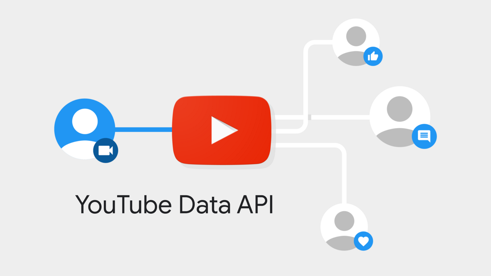

# Introduction


This article will showcase what information we can obtain from YouTube Data API. 
To use the API, one will need to create a Google Cloud Project and create a
credentials. It can be an API key, a service account, an OAuth client id. Please
refer to the [previous article](../2023-07-29-rust-gapi-oauth2) for further
information about the authentication and authorisation for Google APIs. 

In another [previous article](../2023-08-09-sample-youtube-channels-id-with-async-functions) 
we have sample a few hundreds of `channel_id` from the main page of YouTube. 
This article will start from these `channel_id` and retrieve their videos' 
information. 

This article will also talk about the `etag` and the `if-none-match` http 
header. One can utilise this header to save time and bandwidth by caching 
previous response. 

```{r, echo=F}

```

# YouTube Data API

There is a [full documentation](https://developers.google.com/youtube/v3/docs) 
provided by YouTube about this API. In short, one can utilise this API for 
things that can be normally executed on the YouTube website. For example one can
view statistics about videos and channels, view comments of videos, explore
items in playlists, perform search query, etc. This API also allows us to insert 
comments, captions, etc, as long as an authorised token is provided.

As described previously, this article will start from some `channel_id`'s to 
videos published by them. It will cover 3 different endpoints for this purpose: 

- [List Channels](https://developers.google.com/youtube/v3/docs/channels/list)
- [List PlaylistItems](https://developers.google.com/youtube/v3/docs/playlistItems/list)
- [List Videos](https://developers.google.com/youtube/v3/docs/videos/list)

We will obtain, from the *List Channels* endpoint, a `playlist_id` that contains 
all the videos published by the channel. Then we will find all the items 
(videos) inside this playlist from the *List PlaylistItems* endpoint to obtain
the `video_id` of the videos. Finally we can get all the information about the
videos from the *List Videos* endpoint.

Please be aware that there is a quota limit for each of the Google Cloud Project
on each day. Each project will have 10,000 units of quota one each day and 
different methods require different number of units. 

## Before Requests

When you have your access token ready (see [previous article](../2023-07-29-rust-gapi-oauth2)),
the following script gives an example request to the API. 

```{python, eval=F}
import os 
import requests

# Headers for GCP OAuth2 Token
headers = {"Authorization": f'Bearer {os.getenv("GCP_OAUTH_TOKEN")}'}

# Headers for GCP Service Account
headers = {"Authorization": f'Bearer {os.getenv("GCP_SERVICE_ACC_TOKEN")}'}

# Headers for GCP API Key
headers = {"x-goog-api-key": os.getenv("GCP_API_KEY")}

# Request
response = requests.request(
    method=method,     # GET or POST or other HTTP methods
    url=url,           # Endpoint of service
    params=params,     # Query or parameters (if needed)
    json=body,         # Request body        (if needed)
    headers=headers    # The headers specified above
)
```

## List Channel

In this section, we will talk about the *List Channel* endpoint. From the 
[previous article](../2023-08-09-sample-youtube-channels-id-with-async-functions),
we obtained hundreds of `channel_id`'s. 

```{python, eval=F}
channel_ids = [
    "UCx1m6AboILQKMNXbsLjjI4Q",
    "UC-iICi3q1AF_9WI--DVacTQ"
]
```

We will pass these channel ids to the endpoint 

```{yaml}
GET https://www.googleapis.com/youtube/v3/channels
```

We are also required which part(s) of the channel resource we want to request.

```{python, eval=F}
parts = [
    "brandingSettings", "contentDetails", "contentOwnerDetails", "id", 
    "localizations", "snippet", "statistics", "status", "topicDetails"
]
```

Now we are ready to make the request. Notice that you can only request for 50
channels' information in 1 request. 

```{python, eval=F}
params = {
    "part": ",".join(parts),
    "id": ",".join(channel_ids) # Can put 50 channel ids in 1 request
}

response = requests.get(
    url="https://www.googleapis.com/youtube/v3/channels",
    params=params,
    headers=headers    # See "Before Requests" session
)

response.json()

# {
#     "kind": "youtube#channelListResponse",
#     "etag": "UVHnd3n70mtZnwVUmK2mRePbVCo",
#     "pageInfo": {
#         "totalResults": 2,
#         "resultsPerPage": 5
#     },
#     "items": [
#         {
#             "kind": "youtube#channel",
#             "etag": "KGqojbKzM5T5vGED4lXuDv1kPr4",
#             "id": "UCU0zC0L4o0qOos83NLhK5ug",
#             "snippet": {
#                 "title": "Ginger Cat",
#                 "description": "Welcome to Ginger Cat, where for everyone who loves animal and care about their wellbeing. Our goal is to make caring about animals a viral cause. I hope you guys have a good time in here!\n\n",
#                 "customUrl": "@gingercatofficial",
#                 "publishedAt": "2016-11-27T04:02:23Z",
#                 "thumbnails": {...},
#                 "localized": {...},
#                 "country": "US"
#             },
#             "contentDetails": {
#                 "relatedPlaylists": {
#                     "likes": "",
#                     "uploads": "UUU0zC0L4o0qOos83NLhK5ug"
#                 }
#             },
#             "statistics": {
#                 "viewCount": "155315923",
#                 "subscriberCount": "347000",
#                 "hiddenSubscriberCount": false,
#                 "videoCount": "516"
#             },
#             "topicDetails": {...},
#             "status": {...},
#             "brandingSettings": {...},
#             "contentOwnerDetails": {}
#         },
#         {
#             "kind": "youtube#channel",
#             "etag": "4_wvn4zWGtuxuWYN4ddla40T5S8",
#             "id": "UCx1m6AboILQKMNXbsLjjI4Q",
#             "snippet": {
#                 "title": "Proper DIY",
#                 "description": "After many years of 'Doing It Myself' I now invite you the viewer into my world of DIY projects around the house and garden. I hope to inspire everyone to give It a go and to use your new knowledge and skill to save money while having fun and a sense of achievement.\n\nThe channel was launched on 1st Jan 2021 and there will be weekly videos posted throughout 2021 on everything from changing a plug to building and electrical works. Please subscribe to ensure you follow me through the Youtube journey!\n",
#                 "customUrl": "@properdiy",
#                 "publishedAt": "2018-12-03T07:05:09Z",
#                 "thumbnails": {...},
#                 "localized": {...},
#                 "country": "GB"
#             },
#             "contentDetails": {
#                 "relatedPlaylists": {
#                     "likes": "",
#                     "uploads": "UUx1m6AboILQKMNXbsLjjI4Q"
#                 }
#             },
#             "statistics": {
#                 "viewCount": "22997422",
#                 "subscriberCount": "246000",
#                 "hiddenSubscriberCount": false,
#                 "videoCount": "155"
#             },
#             "topicDetails": {...},
#             "status": {...},
#             "brandingSettings": {...},
#             "contentOwnerDetails": {}
#         }
#     ]
# }
```

## List PlaylistItems

From the above step, we can obtain the playlists containing all the videos 
published by the channels. 

```{python, eval=F}
playlist_ids = [
    x["contentDetails"]["relatedPlaylists"]["uploads"] for x in response.json()["items"]
]

playlist_ids

# ['UUU0zC0L4o0qOos83NLhK5ug', 'UUx1m6AboILQKMNXbsLjjI4Q]
```

Now we can list all items inside a playlist. Notice that we can only list the
items in a single playlist in each request. We also need to set the number of 
maximum results to be returned by the service. The maximum `maxResult` is 50. 
Yet, there are always more than 50 videos in a channel. We need to loop through
the pages via the `nextPageToken` key.

The function below will loop through all the videos in a playlist.

```{python, eval=F}
def fetch_all_videos_in_playlist(playlist_id):
    parts = [
        "contentDetails", "id", "snippet", "status"
    ]

    page_token = ""
    items = []

    while page_token is not None:
        params = {
            "part": ",".join(parts),
            "playlistId": playlist_id,
            "maxResults": 50,
            "pageToken": page_token or None
        }

        res = requests.get(
            url="https://www.googleapis.com/youtube/v3/playlistItems",
            params=params,
            headers=headers
        )

        items += res.json()["items"]
        page_token = res.json().get("nextPageToken")
    
    return items
```

We now try out the function. 

```{python, eval=F}
# Fetch all the videos in the first channel
playlist_items = fetch_all_videos_in_playlist(playlist_ids[0])

playlist_items[:2]

# [
#     {
#         "kind": "youtube#playlistItem",
#         "etag": "PbvtsMi9EMMPh7IvYd-Rln4rp-A",
#         "id": "VVVVMHpDMEw0bzBxT29zODNOTGhLNXVnLkUwVXBKZkJ6X2Ew",
#         "snippet": {
#             "publishedAt": "2023-08-14T19:00:05Z",
#             "channelId": "UCU0zC0L4o0qOos83NLhK5ug",
#             "title": "Unforgettable Comedy Duo: Funniest Dog and Human Video Ever! \ud83d\ude31",
#             "description": "Unforgettable Comedy Duo: Funniest Dog and Human Video Ever! \ud83d\ude31\nGet ready to experience the unbreakable bond between humans and their furry best friends, as their mischievous antics and genuine love bring out the purest emotions. Don't miss these videos that will brighten your day!\n----------------------------------------------------------------------------\nBest of the WEEK! Funniest Cats And Dogs Videos \ud83d\ude02\nhttps://www.youtube.com/watch?v=knkv4Habj9s&list=PLDae3oPkWscWqZZtu8gqj20Ug9ijrr7Ae&index=1&t=2s&pp=iAQB \n----------------------------------------------------------------------------\n\n#dogs #pets #animal #dog #dogandhuman #animal2023",
#             "thumbnails": {...},
#             "channelTitle": "Ginger Cat",
#             "playlistId": "UUU0zC0L4o0qOos83NLhK5ug",
#             "position": 0,
#             "resourceId": {
#                 "kind": "youtube#video",
#                 "videoId": "E0UpJfBz_a0"
#             },
#             "videoOwnerChannelTitle": "Ginger Cat",
#             "videoOwnerChannelId": "UCU0zC0L4o0qOos83NLhK5ug"
#         },
#         "contentDetails": {
#             "videoId": "E0UpJfBz_a0",
#             "videoPublishedAt": "2023-08-14T19:00:05Z"
#         },
#         "status": {
#             "privacyStatus": "public"
#         }
#     },
#     {
#         "kind": "youtube#playlistItem",
#         "etag": "EwGgaznGyPJpoc6T-ERkuKE1nt8",
#         "id": "VVVVMHpDMEw0bzBxT29zODNOTGhLNXVnLmtua3Y0SGFiajlz",
#         "snippet": {
#             "publishedAt": "2023-08-12T19:00:16Z",
#             "channelId": "UCU0zC0L4o0qOos83NLhK5ug",
#             "title": "Best of the WEEK! Funniest Cats And Dogs Videos \ud83d\ude02",
#             "description": "Best of the WEEK!  Funniest Cats And Dogs Videos \ud83d\ude02\nBeing an animal lover, these were cute!\n----------------------------------------------------------------------------\nDogs can talk, dogs can understand. Who knew?\ud83d\ude31 \nhttps://www.youtube.com/watch?v=D6aecAswvyE&list=PLDae3oPkWscWqZZtu8gqj20Ug9ijrr7Ae&index=1&pp=iAQB  \n----------------------------------------------------------------------------\n\n#dogs #pets #animal #dog #animal #animal2023",
#             "thumbnails": {...},
#             "channelTitle": "Ginger Cat",
#             "playlistId": "UUU0zC0L4o0qOos83NLhK5ug",
#             "position": 1,
#             "resourceId": {
#                 "kind": "youtube#video",
#                 "videoId": "knkv4Habj9s"
#             },
#             "videoOwnerChannelTitle": "Ginger Cat",
#             "videoOwnerChannelId": "UCU0zC0L4o0qOos83NLhK5ug"
#         },
#         "contentDetails": {
#             "videoId": "knkv4Habj9s",
#             "videoPublishedAt": "2023-08-12T19:00:16Z"
#         },
#         "status": {
#             "privacyStatus": "public"
#         }
#     }
# ]
```

Notice that the *List PlaylistItems* method can only return 20,000 items in 
one single playlist if you are using API key. 

## List Videos

Now we have a list of videos published by the channel `UUU0zC0L4o0qOos83NLhK5ug`. 

```{python, eval=F}
video_ids = [x["snippet"]["resourceId"]["videoId"] for x in playlist_items]

video_ids[:10]

# [
#     'E0UpJfBz_a0', 'knkv4Habj9s', 'D6aecAswvyE', 'uGdDiiro8yg', 'pwNqOkkdry4', 
#     'ylp36nsXpfE', 'VtOY_2-YBSM', '27VRjJfW3A8', '3BGQGzpeOkU', '8qaV3s8kzcU'
# ]
```

We can use the **List Videos** method to extract information about the videos
(`likeCount`, `viewCount`, `commentCount`, `title`, `description`, etc.). Like 
the *List Channels* method, you can only request for 50 videos in 1 request. 
The function below handles this issue. 

```{python, eval=F}
from math import ceil

def fetch_videos(video_ids):
    n = 50
    batches = ceil(len(video_ids) / n)
    ids = [
        video_ids[(n * i):(n * (i + 1))] for i in range(batches)
    ]

    parts = [
        "contentDetails", "id", "liveStreamingDetails",
        "localizations", "player", "recordingDetails",
        "snippet", "statistics", "status", "topicDetails"
    ]

    items = []
    for id in ids:
        params = {
            "part": ",".join(parts),
            "id": ",".join(id)
        }
        response = requests.get(
            url="https://www.googleapis.com/youtube/v3/videos",
            params=params,
            headers=headers
        )
        items += response.json()["items"]
    
    return items
```

Now we are ready for the API request. 

```{python, eval=F}
videos = fetch_videos(video_ids)

videos[:2]

# [
#     {
#         "kind": "youtube#video",
#         "etag": "h7TfUpEP8ts-XNzYvActIph1mg4",
#         "id": "E0UpJfBz_a0",
#         "snippet": {
#             "publishedAt": "2023-08-14T19:00:05Z",
#             "channelId": "UCU0zC0L4o0qOos83NLhK5ug",
#             "title": "Unforgettable Comedy Duo: Funniest Dog and Human Video Ever! \ud83d\ude31",
#             "description": "Unforgettable Comedy Duo: Funniest Dog and Human Video Ever! \ud83d\ude31\nGet ready to experience the unbreakable bond between humans and their furry best friends, as their mischievous antics and genuine love bring out the purest emotions. Don't miss these videos that will brighten your day!\n----------------------------------------------------------------------------\nBest of the WEEK! Funniest Cats And Dogs Videos \ud83d\ude02\nhttps://www.youtube.com/watch?v=knkv4Habj9s&list=PLDae3oPkWscWqZZtu8gqj20Ug9ijrr7Ae&index=1&t=2s&pp=iAQB \n----------------------------------------------------------------------------\n\n#dogs #pets #animal #dog #dogandhuman #animal2023",
#             "thumbnails": {...},
#             "channelTitle": "Ginger Cat",
#             "tags": [...],
#             "categoryId": "24",
#             "liveBroadcastContent": "none",
#             "defaultLanguage": "en",
#             "localized": {...},
#             "defaultAudioLanguage": "en"
#         },
#         "contentDetails": {
#             "duration": "PT8M56S",
#             "dimension": "2d",
#             "definition": "hd",
#             "caption": "false",
#             "licensedContent": true,
#             "contentRating": {},
#             "projection": "rectangular"
#         },
#         "status": {
#             "uploadStatus": "processed",
#             "privacyStatus": "public",
#             "license": "youtube",
#             "embeddable": true,
#             "publicStatsViewable": true,
#             "madeForKids": false
#         },
#         "statistics": {
#             "viewCount": "34275",
#             "likeCount": "749",
#             "favoriteCount": "0",
#             "commentCount": "28"
#         },
#         "player": {...},
#         "topicDetails": {...},
#         "recordingDetails": {},
#         "localizations": {...}
#     },
#     {
#         "kind": "youtube#video",
#         "etag": "hFSA6Fj9y8Hx-zAKzavsM9vR8Kk",
#         "id": "knkv4Habj9s",
#         "snippet": {
#             "publishedAt": "2023-08-12T19:00:16Z",
#             "channelId": "UCU0zC0L4o0qOos83NLhK5ug",
#             "title": "Best of the WEEK! Funniest Cats And Dogs Videos \ud83d\ude02",
#             "description": "Best of the WEEK!  Funniest Cats And Dogs Videos \ud83d\ude02\nBeing an animal lover, these were cute!\n----------------------------------------------------------------------------\nDogs can talk, dogs can understand. Who knew?\ud83d\ude31 \nhttps://www.youtube.com/watch?v=D6aecAswvyE&list=PLDae3oPkWscWqZZtu8gqj20Ug9ijrr7Ae&index=1&pp=iAQB  \n----------------------------------------------------------------------------\n\n#dogs #pets #animal #dog #animal #animal2023",
#             "thumbnails": {...},
#             "channelTitle": "Ginger Cat",
#             "tags": [...],
#             "categoryId": "24",
#             "liveBroadcastContent": "none",
#             "defaultLanguage": "en",
#             "localized": {...},
#             "defaultAudioLanguage": "en"
#         },
#         "contentDetails": {
#             "duration": "PT10M19S",
#             "dimension": "2d",
#             "definition": "hd",
#             "caption": "false",
#             "licensedContent": true,
#             "contentRating": {},
#             "projection": "rectangular"
#         },
#         "status": {
#             "uploadStatus": "processed",
#             "privacyStatus": "public",
#             "license": "youtube",
#             "embeddable": true,
#             "publicStatsViewable": true,
#             "madeForKids": false
#         },
#         "statistics": {
#             "viewCount": "37920",
#             "likeCount": "588",
#             "favoriteCount": "0",
#             "commentCount": "25"
#         },
#         "player": {...},
#         "topicDetails": {...},
#         "recordingDetails": {},
#         "localizations": {...}
#     }
# ]
```

## Etag

Every time you request a resource from these methods, an `etag` will be attached
within the response. One of the main use of this tag is to keep track of the 
resource. If the resource has not changed since your last request, the `etag` 
will stay the same. 

One can pass the `etag` along with the request in the `if-none-match` header 
and if the resource's `etag` match with the one you provided, the server will 
return HTTP status 304, indicates that you can use the previous response. 
Otherwise, it will return the updated resources. 

```{python, eval=F}
channel_id = "UCSXwxpWZQ7XZ1WL3wqevChA"

response = requests.get(
    url="https://www.googleapis.com/youtube/v3/channels",
    params={"id":channel_id},
    headers=headers
)

headers["if-none-match"] = response.json()["etag"]

response = requests.get(
    url="https://www.googleapis.com/youtube/v3/channels",
    params={"id":channel_id},
    headers=headers
)

response.status_code

# 304
```


