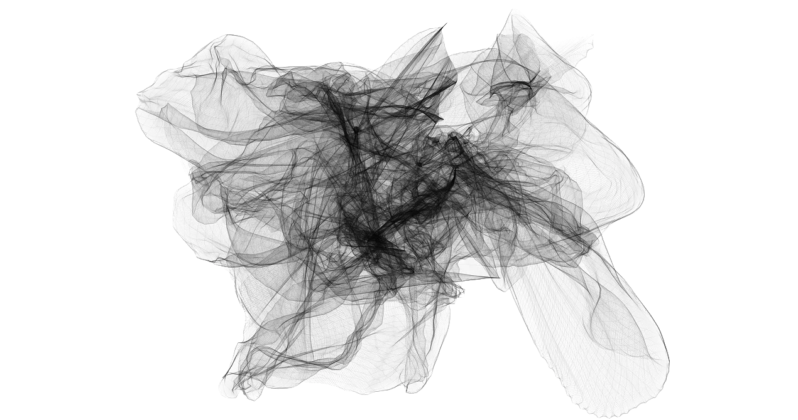

```{r setup, include=FALSE}
knitr::opts_chunk$set(
  echo = FALSE,
  dev.args = list(bg = 'transparent'),
  # dev='svglite',
  # fig.align='center',
  #out.width='75%', fig.asp=.75,
  cache.rebuild = F,
  cache = F
)
```

<div class='index-title' style="">
<h1>
Math, Data, Infra
</h1>
</div>


